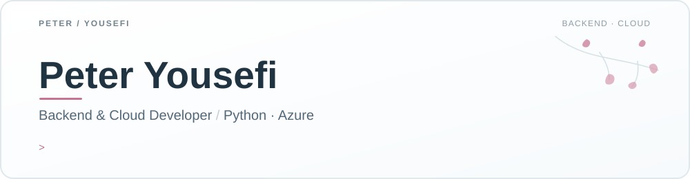

  

 

I build backend services and cloud-ready applications with a focus on **reliability, evidence, and human control**. I'm a computer science graduate and **Microsoft Certified: Azure Fundamentals (AZ-900)**. Right now I'm working with Python, PostgreSQL, and Azure infrastructure while learning more about deployment, observability, and the cost of running things well.

### Featured work

<table>
  <tr>
    <td width="50%" valign="top">
      <h3><a href="https://github.com/PeterYousefi/AegisOps">AegisOps ↗</a></h3>
      
<strong>Human-governed AI incident response.</strong> Brings alerts, logs, metrics, and runbooks together to propose evidence-grounded remediation. A person must approve every simulated action, and an append-only trail records what happened.

      FastAPI · PostgreSQL · Next.js · Docker · GitHub Actions · Azure Bicep
    </td>
    <td width="50%" valign="top">
      <h3><a href="https://github.com/PeterYousefi/Falsifier">Falsifier ↗</a></h3>
      
<strong>Exoplanet candidates tested against false positives.</strong> Examines transit light curves and other diagnostics to challenge apparent planet signals before they become claims.

      Python · transit diagnostics · asteroseismic vetting
    </td>
  </tr>
  <tr>
    <td width="50%" valign="top">
      <h3><a href="https://github.com/PeterYousefi/Lumina">Lumina ↗</a></h3>
      
<strong>Marketing campaigns from a business brief.</strong> A five-step generation workflow turns an idea into campaign material, with an offline fallback when the AI service is unavailable.

      Python · Flask · IBM watsonx
    </td>
    <td width="50%" valign="top">
      <h3><a href="https://github.com/PeterYousefi/Continuity">Continuity ↗</a></h3>
      
<strong>Consistent storyboards across scenes.</strong> Uses character guidance and frame-by-frame generation so a character stays recognizable, with a comparison view and per-frame regeneration.

      TypeScript · Next.js · gpt-image-1
    </td>
  </tr>
</table>

### Tools I work with

`Python` · `SQL` · `FastAPI` · `Flask` · `PostgreSQL` · `TypeScript` · `Next.js` · `Docker` · `GitHub Actions` · `Azure`

Currently exploring: Azure AI App & Agent Developer (AI-103), Bicep, Terraform, CI/CD, and Linux.

### Development activity

The best record of my work is in the [repositories above](https://github.com/PeterYousefi?tab=repositories) and my [contribution history](https://github.com/PeterYousefi?tab=overview). I prefer showing the decisions, tests, and trade-offs in a project over a counter on this page.

---

<a href="https://petery.org">Portfolio</a> · <a href="https://www.linkedin.com/in/peteryo/">LinkedIn</a> · <a href="mailto:pete@petery.org">pete@petery.org</a>
